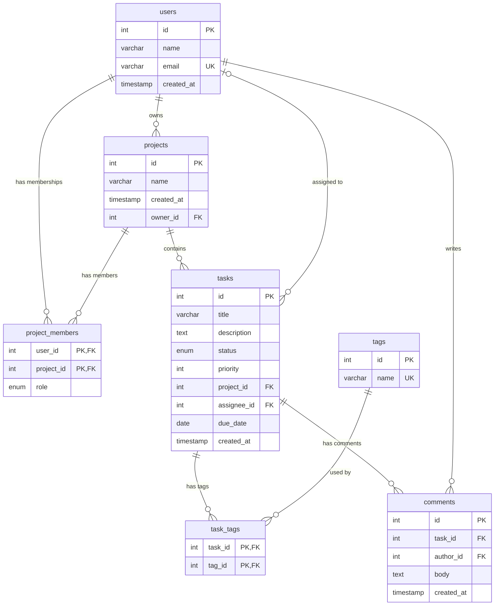
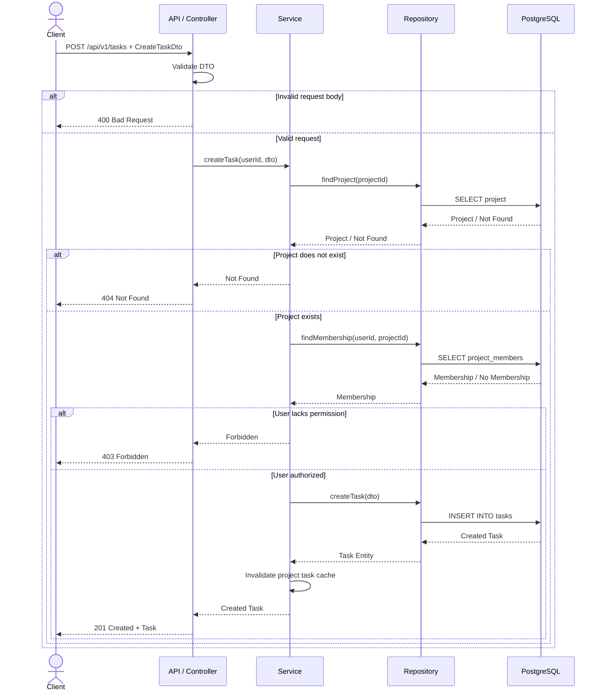

# Task Management Platform — System Design

## Week 7 — Assignment 1

This document defines the system design for the Task Management platform that was built as the fixed database domain during Weeks 5 and 6. It describes the system requirements, relational data model, layered architecture, request flow, non-functional strategy, and architectural trade-offs that will guide the Phase 4 NestJS implementation.

---

# W1 — Overview and Requirements

## 1.1 System Overview

The Task Management platform allows users to create and manage projects, organize project members through role-based access control, create and track tasks, assign tasks to users, organize tasks with tags, and add comments to tasks. Each project belongs to one owner and can have multiple members with different roles, while each task belongs to one project and may optionally be assigned to a user. The system uses PostgreSQL as the persistent data store and follows a layered REST API architecture consisting of a client, API/controller, service, repository, and database layer. This design provides the foundation for the NestJS backend that will be implemented in Phase 4.

---

## 1.2 Functional Requirements

### FR-1 — Create and Manage Tasks

Authenticated users with appropriate project permissions must be able to create tasks within projects they are authorized to access. Users must also be able to view, update, and delete tasks according to their project role.

A task contains:

* `id`
* `title`
* `description`
* `status`
* `priority`
* `project_id`
* `assignee_id`
* `due_date`
* `created_at`

The supported task statuses are:

* `todo`
* `in_progress`
* `done`

The priority must be an integer from **1 to 5**.

---

### FR-2 — Manage Projects and Project Members

Users must be able to create and manage projects according to their permissions.

Projects have one owner and can contain multiple project members.

Each project member has one of four roles:

* `owner`
* `admin`
* `member`
* `viewer`

These roles are used to determine what actions a user can perform within a project.

---

### FR-3 — Organize Tasks and Add Comments

Authorized users must be able to organize tasks using tags and communicate through task comments.

A task can have multiple tags, and a tag can belong to multiple tasks through the `task_tags` join table.

Users can also write comments on tasks they are authorized to access.

---

# W1 — Non-Functional Requirements

## NFR-1 — Performance

The API should target a response time of **less than 300 ms at the 95th percentile** for normal authenticated requests under expected application load, excluding unusually expensive operations and external service failures.

Pagination must be applied to list endpoints so that the API does not unnecessarily retrieve very large datasets.

---

## NFR-2 — Availability

The production system should target **99.5% monthly availability**, excluding planned maintenance.

Database backups and an appropriate recovery process should be maintained so that infrastructure failures do not permanently result in data loss.

---

## NFR-3 — Security

Protected API operations must require server-side authentication and authorization.

Project permissions must be determined using authoritative server-side data rather than values supplied by the client.

Passwords must be stored as secure password hashes during Phase 4, and sensitive authentication information must never be returned in API responses.

---

# W2 — Entity Relationship Diagram

The Task Management platform uses the **fixed seven-table schema** specified for Week 7.

The seven tables are:

1. `users`
2. `projects`
3. `project_members`
4. `tasks`
5. `tags`
6. `task_tags`
7. `comments`

The ERD below uses Mermaid `erDiagram` notation.



---

## W2 — Fixed Schema Constraints

The ERD represents the exact seven-table domain required for Week 7. In addition to the relationships and keys shown in the diagram, the following database constraints apply to the fixed schema:

### `users`

* `id` is the primary key.
* `email` is **UNIQUE** and **NOT NULL**.
* `created_at` stores the user creation timestamp.

### `projects`

* `id` is the primary key.
* `name` is **NOT NULL**.
* `owner_id` is a **NOT NULL foreign key** referencing `users.id`.
* Each project therefore has exactly one owner.

### `project_members`

* `user_id` is a foreign key referencing `users.id`.
* `project_id` is a foreign key referencing `projects.id`.
* `(user_id, project_id)` forms the **composite primary key**.
* `role` is **NOT NULL** and uses the values:

  * `owner`
  * `admin`
  * `member`
  * `viewer`

### `tasks`

* `id` is the primary key.
* `title` is **NOT NULL**.
* `description` is optional.
* `status` uses the values:

  * `todo`
  * `in_progress`
  * `done`

* `priority` is an integer restricted to **1–5**.
* `project_id` is a **NOT NULL foreign key** referencing `projects.id`.
* `assignee_id` is a **nullable foreign key** referencing `users.id`.
* `due_date` is optional.
* `created_at` stores the task creation timestamp.

### `tags`

* `id` is the primary key.
* `name` is **UNIQUE** and **NOT NULL**.

### `task_tags`

* `task_id` is a foreign key referencing `tasks.id`.
* `tag_id` is a foreign key referencing `tags.id`.
* `(task_id, tag_id)` forms the **composite primary key**.

### `comments`

* `id` is the primary key.
* `task_id` is a **NOT NULL foreign key** referencing `tasks.id`.
* `author_id` is a **NOT NULL foreign key** referencing `users.id`.
* `body` is **NOT NULL**.
* `created_at` stores the comment creation timestamp.

These constraints preserve the fixed relational model established in Weeks 5 and 6 and ensure that the Week 7 system design remains consistent with the required database domain.

---

## W2 — Relationship Explanation

### Users → Projects

One `users` record can own zero or many `projects`.

Each `projects` record has exactly one owner through:

projects.owner_id → users.id

Cardinality:

users 1 ──────── 0..* projects

---

### Users → Project Members

A user can have zero or many project memberships.

Each `project_members` record belongs to exactly one user.

Cardinality:

users 1 ──────── 0..* project_members

---

### Projects → Project Members

A project can have zero or many members.

Each `project_members` record belongs to exactly one project.

Cardinality:

projects 1 ──────── 0..* project_members

The `project_members` table resolves the many-to-many relationship between users and projects.

Its composite primary key is:

(user_id, project_id)

The `role` column stores:

owner
admin
member
viewer

---

### Projects → Tasks

A project can contain zero or many tasks.

Every task belongs to exactly one project because:

tasks.project_id

is required.

Cardinality:

projects 1 ──────── 0..* tasks

---

### Users → Tasks / Assignee

A user can be assigned zero or many tasks.

A task can have zero or one assigned user because:

tasks.assignee_id

is nullable.

Cardinality:

users 0..1 ──────── 0..* tasks
One user can be assigned to zero or many tasks.
Each task can have zero or one assigned user.

The important point is that **assignment is optional**. A task can exist without an assignee.

---

### Tasks → Task Tags

A task can have zero or many `task_tags` records.

Each `task_tags` record refers to exactly one task.

Cardinality:

tasks 1 ──────── 0..* task_tags

---

### Tags → Task Tags

A tag can be associated with zero or many `task_tags` records.

Each `task_tags` record refers to exactly one tag.

Cardinality:

tags 1 ──────── 0..* task_tags

Together, `tasks`, `task_tags`, and `tags` form a many-to-many relationship:

tasks ↔ tags

The composite primary key of `task_tags` is:

(task_id, tag_id)

---

### Tasks → Comments

A task can have zero or many comments.

Every comment belongs to exactly one task.

Cardinality:

tasks 1 ──────── 0..* comments

---

### Users → Comments

A user can write zero or many comments.

Every comment has exactly one author through:

comments.author_id → users.id

Cardinality:

users 1 ──────── 0..* comments

---

## W2 — Fixed Schema Notes

The ERD intentionally contains **only the seven required tables**.

Authentication-specific database changes are not included in this ERD.

Phase 4 will later add:

* `users.password_hash`
* `refresh_tokens`

However, these are intentionally excluded from the Week 7 ERD because the assignment explicitly requires the ERD to remain the fixed seven-table domain.

---

# C1 — Architecture

## 3.1 Architecture Overview

The Task Management platform follows a layered architecture:

┌──────────────────────────┐
│         Client           │
│    Web / Mobile Client   │
└────────────┬─────────────┘
             │ HTTP Request
             ▼
┌──────────────────────────┐
│    API / Controller      │
│ Routes + DTO Validation  │
└────────────┬─────────────┘
             │ Validated DTO
             ▼
┌──────────────────────────┐
│         Service          │
│ Business + Auth Rules    │
└────────────┬─────────────┘
             │ Domain Operation
             ▼
┌──────────────────────────┐
│       Repository         │
│   TypeORM Data Access    │
└────────────┬─────────────┘
             │ SQL / ORM Query
             ▼
┌──────────────────────────┐
│       PostgreSQL         │
│     Persistent Data      │
└──────────────────────────┘

Each layer has a specific responsibility.

---

## 3.2 Client Layer

The client is responsible for interacting with the user and communicating with the REST API.

Responsibilities include:

* Displaying application data.
* Collecting form input.
* Sending HTTP requests.
* Including authentication credentials.
* Displaying successful responses.
* Displaying API errors.
* Managing temporary UI state.

The client is **not trusted for authorization**.

For example, the client may display:

role = "admin"

but the backend must not trust that value when deciding whether an operation is permitted.

---

## 3.3 API / Controller Layer

The controller is responsible for the HTTP boundary.

Responsibilities include:

* Defining API routes.
* Receiving HTTP requests.
* Reading path parameters.
* Reading query parameters.
* Receiving request DTOs.
* Triggering DTO validation.
* Calling the appropriate service.
* Returning HTTP responses.
* Mapping known failures to HTTP status codes.

Controllers should remain thin.

They should not contain:

* Direct database queries.
* Complex business rules.
* Repeated authorization logic.
* Data persistence logic.

---

## 3.4 Service Layer

The service layer contains the application's business logic.

Responsibilities include:

* Applying business rules.
* Checking project membership.
* Checking project roles.
* Checking resource existence.
* Coordinating repositories.
* Creating and updating tasks.
* Handling task assignment rules.
* Handling business-level authorization.
* Invalidating relevant caches after writes.

The service receives validated data from the controller and coordinates the operation.

---

## 3.5 Repository Layer

The repository layer handles database access.

Responsibilities include:

* Querying PostgreSQL.
* Inserting records.
* Updating records.
* Deleting records.
* Loading required relations.
* Applying database-level filtering.
* Applying pagination.
* Returning entities/results to the service.

The repository should not decide whether a user has permission to perform an operation.

---

## 3.6 Database Layer

PostgreSQL is the persistent storage layer.

It maintains:

* Users
* Projects
* Project memberships
* Tasks
* Tags
* Task-tag relationships
* Comments

Database constraints enforce data integrity through:

* Primary keys
* Foreign keys
* Composite primary keys
* Unique constraints
* Not-null constraints
* Enum values

---

# C1 — Create Task Request Trace

The following section traces the operation:

POST /api/v1/tasks

from the client through every architectural layer.

---

## Step 1 — Client → Controller

The client sends a request containing a task DTO.

Example:

```json
{
  "title": "Implement task filtering",
  "description": "Add status-based filtering to the task list",
  "status": "todo",
  "priority": 3,
  "project_id": 1,
  "assignee_id": 2,
  "due_date": "2026-09-10"
}
```

The client also provides the authentication credentials required by the protected endpoint.

The request enters the controller layer.

---

## Step 2 — Controller Validation

The controller receives the request body as a DTO.

Conceptually:

CreateTaskDto

The DTO is validated before business logic is executed.

Validation may check:

* Required title.
* Valid status.
* Priority between 1 and 5.
* Valid project ID.
* Valid optional assignee ID.
* Valid date format.

If the request body is invalid:

HTTP 400 Bad Request

The request does not continue to the service.

---

## Step 3 — Controller → Service

If the DTO passes validation, the controller passes:

authenticatedUserId
+
validated CreateTaskDto

to the task service.

The service now performs the business-level checks.

---

## Step 4 — Service Checks Project

The service verifies that the requested project exists.

Conceptually:

find project by project_id

If the project does not exist:

HTTP 404 Not Found

The task is not created.

---

## Step 5 — Service Checks Authorization

The service checks the authenticated user's membership in the project.

The authorization decision is based on:

project_members

and:

project_members.role

The user's client-side role is not trusted.

If the user does not have permission to create a task:

HTTP 403 Forbidden

The task is not created.

---

## Step 6 — Service → Repository

If the project exists and the user is authorized, the service sends the validated task data to the repository.

Conceptually:

createTask(validatedTaskData)

The repository performs the required TypeORM database operation.

---

## Step 7 — Repository → PostgreSQL

The repository sends the database operation to PostgreSQL.

Conceptually:

```sql
INSERT INTO tasks (...)
VALUES (...);
```

PostgreSQL checks:

* Primary key integrity.
* Foreign key integrity.
* Required values.
* Enum constraints.
* Other database constraints.

If the operation succeeds, PostgreSQL returns the created record.

---

## Step 8 — Repository → Service

The repository returns the newly created task entity to the service.

The service may perform any additional business processing required by the application.

If the project task list is cached, the affected cache entry is invalidated because a new task has changed the list.

---

## Step 9 — Service → Controller

The service returns the created task to the controller.

The controller converts the result into the API response representation.

---

## Step 10 — Controller → Client

The controller returns:

HTTP 201 Created

with the created task in the response body.

---

## C1 — Failure Mapping

| Situation                     | Result             |
| ----------------------------- | ------------------ |
| Invalid request body          | `400 Bad Request`  |
| User is not authenticated     | `401 Unauthorized` |
| User does not have permission | `403 Forbidden`    |
| Project does not exist        | `404 Not Found`    |
| Conflicting/duplicate data    | `409 Conflict`     |
| Successful task creation      | `201 Created`      |

This keeps HTTP concerns at the API boundary while business logic remains inside the service layer.

---

# C2 — Non-Functional Plan

## 4.1 Caching Strategy

Caching is introduced only for a specific high-value read rather than being applied indiscriminately.

### Selected Cached Read

The selected read is:

GET /api/v1/projects/:id/tasks

This endpoint returns a project's task list and is a suitable caching candidate because task lists can be read frequently.

A conceptual cache key is:

project:{projectId}:tasks:{queryParameters}

The query parameters include relevant pagination, filtering, and sorting values.

---

## C2 — Cache Invalidation

The cached task list must be invalidated after writes that can change the returned task list.

Examples include:

POST /api/v1/tasks
PATCH /api/v1/tasks/:id
DELETE /api/v1/tasks/:id

Other task changes that affect the returned representation must also invalidate the affected cache.

For example:

* Creating a task.
* Deleting a task.
* Moving a task to another project.
* Changing task status when status filtering is used.
* Changing priority when priority sorting is used.
* Changing tags when tags are included in the cached representation.

The rule is: A successful task write that changes the project task-list representation invalidates the affected project's task-list cache.

---

## C2 — Cost of Caching

Caching provides:

* Faster repeated reads.
* Lower database load.
* Better scalability for read-heavy traffic.

However, the design accepts these costs:

* Cache invalidation complexity.
* Additional infrastructure.
* Additional memory usage.
* Possible stale data if invalidation fails.
* More complex debugging.

A cached task list may temporarily contain stale information if a cache failure occurs.

However, authorization decisions must not depend on this cache.

---

# C2 — Scaling Strategy

The initial architecture uses PostgreSQL as the primary database.

If read traffic grows significantly, read replicas can be introduced.

                         ┌──────────────────┐
                         │   Read Replica   │
                         └────────▲─────────┘
                                  │
                                Reads
                                  │
Client → API → Repository ────────┤
                                  │
                                Writes
                                  │
                         ┌────────▼─────────┐
                         │     Primary      │
                         │    PostgreSQL    │
                         └──────────────────┘

---

## C2 — Write Path

All writes go to the primary database.

Examples:

* Creating a task.
* Updating a task.
* Deleting a task.
* Creating a project.
* Updating membership.
* Adding a comment.
* Creating a tag relationship.

The primary remains the authoritative source for writes.

---

## C2 — Read Path

Suitable non-critical reads can be sent to read replicas.

This reduces read traffic on the primary database and allows horizontal scaling of database reads.

---

## C2 — Cost of Read Replicas

The main cost accepted is:

Replication lag.

A write committed to the primary may take some time to appear on a read replica.

Therefore, sending every read to a replica could cause the client to receive stale data immediately after a successful write.

---

# C2 — Reads That Must Use the Primary

Authorization-sensitive reads must use authoritative data.

For example, consider a user whose role changes:

admin → viewer

A role check performed against a lagging replica could temporarily return the old role.

That could incorrectly grant permissions.

Therefore, current project membership and authorization checks must use the primary database when the latest committed state is required.

Read-after-write operations that require immediate visibility may also use the primary.

### Why?

The cost is reduced read distribution, but the system gains stronger consistency for security-sensitive operations.

---

# C2 — Consistency Strategy

The system accepts different consistency levels depending on the operation.

### Stronger Consistency Required

The primary database should be used for:

* Authorization checks.
* Project membership changes.
* Critical writes.
* Critical read-after-write operations.

### Eventual Consistency Acceptable

Eventual consistency can be accepted for:

* Non-critical replica reads.
* Cached task-list reads.
* Future analytics-style reads.

The design explicitly accepts that a cached or replicated read can temporarily lag behind the primary state.

---

# C2 — N+1 Consideration

The API must avoid causing N+1 database queries.

For example, a task list containing 20 tasks should not result in:

1 query → load 20 tasks

20 additional queries → load each task's project

That would produce:

1 + 20 = 21 queries

Instead, required relations should be loaded efficiently using TypeORM relations, joins, or batched queries.

Pagination must also happen at the database level so that only the requested records are retrieved.

This reduces unnecessary database work and helps the API meet the performance target.

---

# C3 — Trade-Offs

## C3.1 Offset Pagination vs Cursor Pagination

### Option A — Offset Pagination

Example:

?page=3&pageSize=20

### Advantages

* Simple API design.
* Easy to implement.
* Easy for frontend developers to understand.
* Supports direct navigation to a specific page.
* Fits the application's expected list interface.

### Disadvantages

* Deep pages can require the database to skip many rows.
* Insertions/deletions can cause records to move between pages.
* Performance can degrade for very large offsets.

---

### Option B — Cursor Pagination

Example:

?cursor=abc123

### Advantages

* Efficient for deep pagination.
* Better suited to very large datasets.
* More stable when records are frequently inserted.
* Avoids large offset scans.

### Disadvantages

* More complex to implement.
* More complex for clients.
* Directly jumping to an arbitrary page is difficult.
* Requires cursor generation and validation.

### Decision Criterion

The current Task Management application needs a simple and predictable page-based API, and the expected dataset does not justify the additional cursor complexity at this stage.

### Decision

Use offset pagination with:

?page=&pageSize=

and a defined maximum `pageSize`.

Cursor pagination can be reconsidered if measured production traffic or dataset size demonstrates that deep-page performance has become a real bottleneck.

---

# C3.2 Normalization vs Denormalization

## Option A — Normalized Relational Model

The existing schema keeps related data in separate tables.

### Advantages

* Reduces data duplication.
* Maintains a clear source of truth.
* Makes updates easier to reason about.
* Uses PostgreSQL relational constraints effectively.
* Matches the database model already established in Weeks 5 and 6.

### Disadvantages

* Some reads require joins.
* Aggregated information may require additional queries.
* Complex reports can become more expensive.

---

## Option B — Denormalization

Frequently accessed information could be duplicated into another table or record.

### Advantages

* Can make selected reads faster.
* Can reduce joins or repeated aggregation.
* Can improve performance for specific high-read fields.

### Disadvantages

* Duplicated data must remain synchronized.
* Writes become more complex.
* Incorrect synchronization can cause inconsistent data.
* Additional mechanisms are required to maintain correctness.

### Decision Criterion

The current Task Management system has a moderate expected data size, and maintaining relational integrity is more important than optimizing an unmeasured bottleneck.

### Decision

Keep the core schema **normalized**.

Denormalization should only be introduced after profiling identifies a real performance problem and the additional consistency mechanism can be justified.

---

# C3.3 Centralized Role Guard vs Authorization in Every Service

## Option A — Authorization Checks in Every Service

Each service would independently check whether the current user has the required role.

### Advantages

* Service has direct access to domain context.
* Complex business-specific permissions can be handled locally.
* Authorization can be tailored to each operation.

### Disadvantages

* Repeated permission logic.
* Increased code duplication.
* Greater risk of inconsistent authorization rules.
* A forgotten check in one service could create a security vulnerability.

---

## Option B — Centralized Authorization Guard

Route-level authorization is handled by a centralized authorization guard.

### Advantages

* Consistent authorization behavior.
* Less repeated code.
* Route access requirements are easier to identify.
* Controllers and services remain cleaner.
* Fits naturally with NestJS guards.

### Disadvantages

* Some resource-specific rules still require service-level checks.
* Guards need sufficient request/resource context.
* Complex authorization logic can make a guard difficult to maintain if everything is placed inside it.

### Decision Criterion

The system has four explicit project roles:

owner
admin
member
viewer

and many protected project routes. Consistent role enforcement is therefore important.

### Decision

Use **centralized authorization guards for route-level role restrictions**, while keeping resource-specific business authorization checks in the service layer.

This avoids duplicated basic role checks while still allowing the service to validate contextual rules.

---

# X1 — Challenge: Sequence Diagram

The following sequence diagram represents the same **Create Task** operation described in C1.

Each major architecture layer has its own lifeline, and failure paths are included.



### X1 Check

This diagram contains:

* One client lifeline.
* One controller lifeline.
* One service lifeline.
* One repository lifeline.
* One database lifeline.
* The same request order as the C1 architecture trace.
* `400` validation failure.
* `404` missing project failure.
* `403` authorization failure.
* Successful `201` response.

---

# X2 — Challenge: Where State Lives

The system separates persistent application state, authentication state, and temporary client state.

---

## X2.1 State Stored in PostgreSQL

PostgreSQL is the authoritative source for persistent application data.

The fixed domain stores:

users
projects
project_members
tasks
tags
task_tags
comments

Project authorization information is stored in:

project_members.role

Therefore, PostgreSQL is the authoritative source for project membership and role information.

In Phase 4, authentication persistence will additionally introduce:

users.password_hash
refresh_tokens

These are intentionally outside the current Week 7 seven-table ERD.

---

## X2.2 State Stored in JWT

The access JWT contains authentication identity information.

A typical identity claim is:

sub = user ID

The token establishes who the authenticated user is.

The JWT should **not** be treated as the permanent source of truth for project roles.

Project roles remain in PostgreSQL.

---

## X2.3 State Stored in the Client

The client can store temporary UI and interaction state, including:

* Current page.
* Selected filters.
* Search text.
* Form state.
* Loading state.
* Temporary task-list data.
* UI preferences.

The client must not be the only location containing authorization information.

For example, the following cannot be trusted:

clientRole = "admin"

The backend must determine the actual role from authoritative server-side state.

---

## X2.4 What Happens When a Role Is Revoked?

Consider:

User role:
admin

The user currently has a valid access token.

An administrator then changes the user's project role:

admin → viewer

The existing JWT can remain valid for authentication, but the old `admin` role must not continue to grant permissions.

The backend checks the current project membership/role from authoritative server-side data when authorization is required.

Therefore:

Valid JWT
       +
Current database role
       ↓
Authorization decision

rather than:

Valid JWT
       +
Old client/token role
       ↓
Authorization decision


This means there is no accepted authorization window based solely on the old role.

The token's remaining lifetime does not preserve the revoked project permissions.

---

# X3 — Challenge: Targeted Denormalization

A possible future denormalized field is:

tasks.comment_count

This field is not part of the current fixed seven-table schema. It is presented only as a future optimization option.

---

## X3.1 Why Denormalize This Field?

Without a counter, displaying the number of comments for every task may require aggregation against:

comments

For a task list containing many tasks, repeatedly calculating comment counts could increase database work.

A stored:

comment_count

would allow the task list to retrieve the count directly.

---

## X3.2 Read Benefit

A task list could retrieve:

task.id
task.title
task.status
task.comment_count

without calculating the count from the comments table for every task.

This can reduce read-time aggregation.

---

## X3.3 Write Cost

The counter introduces additional writes.

When a comment is created:

INSERT comment
       ↓
tasks.comment_count + 1

When a comment is deleted:

DELETE comment
       ↓
tasks.comment_count - 1

Therefore, comment writes become more complex.

---

## X3.4 Synchronization Mechanism

The proposed mechanism is a **PostgreSQL database trigger**.

The trigger would update `tasks.comment_count` whenever a comment is inserted or deleted.

Conceptually:

INSERT comments
       ↓
Database Trigger
       ↓
Increment tasks.comment_count

and:

DELETE comments
       ↓
Database Trigger
       ↓
Decrement tasks.comment_count

---

## X3.5 Failure Mode

The trigger operation should execute within the same database transaction as the comment operation.

If the trigger fails, the transaction should fail rather than allowing the comment and counter to become permanently inconsistent.

If an operational issue causes historical inconsistency, a reconciliation query can recalculate:

COUNT(comments.id)
GROUP BY comments.task_id

and restore the correct counter values.

---

## X3.6 Cost Accepted

The design accepts:

* Additional write work.
* More complex database behavior.
* Additional maintenance.
* The need for reconciliation if operational problems occur.

The optimization should only be introduced if profiling demonstrates that comment-count aggregation is a meaningful read bottleneck.

---

# 6. Overall Design Decisions

The system design follows these principles:

### 1. Fixed Domain

The Week 7 ERD uses exactly the required seven tables:

users
projects
project_members
tasks
tags
task_tags
comments

### 2. Separation of Responsibilities

Each architecture layer has a clear responsibility:

Client
  ↓
Controller
  ↓
Service
  ↓
Repository
  ↓
PostgreSQL

### 3. Thin Controllers

Controllers handle HTTP concerns and validation but do not contain business or database logic.

### 4. Business Logic in Services

Business rules and contextual authorization checks are handled by the service layer.

### 5. Database Access in Repositories

Repositories isolate TypeORM and PostgreSQL operations from the rest of the application.

### 6. Server-Side Authorization

The client cannot grant itself permissions. Project roles come from authoritative server-side data.

### 7. Explicit Caching

Only a specific read is selected for caching, and the writes that invalidate it are explicitly identified.

### 8. Controlled Scaling

Read replicas can improve read throughput, but replication lag is accepted as their cost.

### 9. Consistency for Security

Authorization-sensitive reads use the primary database when the latest committed state is required.

### 10. Measured Optimization

Denormalization and cursor pagination are not introduced simply because they sound faster. They should be introduced when measured requirements justify their complexity.

---

# 7. Assignment 1 Acceptance Criteria

## W1 — Overview and Requirements

* [x] Overview explains what the system does.
* [x] Three functional requirements are provided.
* [x] Three non-functional requirements are provided.
* [x] Functional requirements describe user capabilities.
* [x] Non-functional requirements describe measurable qualities.
* [x] Performance has a numerical target.
* [x] Availability has a numerical target.
* [x] Security requirements are defined.

---

## W2 — ERD

* [x] All seven required tables are present.
* [x] Table names match the fixed schema.
* [x] Column names match the fixed schema.
* [x] Primary keys are shown.
* [x] Foreign keys are shown.
* [x] `project_members` has a composite primary key.
* [x] `task_tags` has a composite primary key.
* [x] Task ↔ Tag many-to-many relationship is represented through `task_tags`.
* [x] `tasks.assignee_id` is optional.
* [x] All relationships have cardinalities.
* [x] Authentication tables are not incorrectly added to the ERD.

---

## C1 — Architecture

* [x] Client layer defined.
* [x] API/controller layer defined.
* [x] Service layer defined.
* [x] Repository layer defined.
* [x] PostgreSQL/database layer defined.
* [x] Responsibilities are separated.
* [x] Create Task operation traced through every layer.
* [x] DTO validation is identified.
* [x] Authorization check is identified.
* [x] `400` invalid body mapping is defined.
* [x] `403` permission failure mapping is defined.
* [x] `404` missing project mapping is defined.
* [x] Successful `201` response is defined.

---

## C2 — Non-Functional Plan

* [x] Specific cached read identified.
* [x] Cache invalidation writes identified.
* [x] Cache staleness cost identified.
* [x] Read/write scaling strategy defined.
* [x] Writes use the primary.
* [x] Suitable reads can use replicas.
* [x] Replication lag is explicitly identified as a cost.
* [x] At least one read requiring the primary is identified.
* [x] Reason for primary-only read is provided.
* [x] N+1 concern is addressed.

---

## C3 — Trade-Offs

### Trade-Off 1

* [x] Offset pagination considered.
* [x] Cursor pagination considered.
* [x] Advantages of both provided.
* [x] Disadvantages of both provided.
* [x] Decision criterion provided.
* [x] Decision made.

### Trade-Off 2

* [x] Normalization considered.
* [x] Denormalization considered.
* [x] Advantages of both provided.
* [x] Disadvantages of both provided.
* [x] Decision criterion provided.
* [x] Decision made.

### Trade-Off 3

* [x] Service-level authorization considered.
* [x] Centralized guard authorization considered.
* [x] Advantages of both provided.
* [x] Disadvantages of both provided.
* [x] Decision criterion provided.
* [x] Decision made.

---

# X1 — Challenge Checklist

* [x] Mermaid `sequenceDiagram`.
* [x] Client lifeline.
* [x] Controller lifeline.
* [x] Service lifeline.
* [x] Repository lifeline.
* [x] Database lifeline.
* [x] Happy path.
* [x] Validation failure.
* [x] Missing project failure.
* [x] Permission failure.

---

# X2 — Challenge Checklist

* [x] PostgreSQL state explained.
* [x] JWT state explained.
* [x] Client state explained.
* [x] Authorization data is not trusted from the client.
* [x] Project roles remain server-side.
* [x] Role revocation behavior explained.
* [x] Existing JWT does not preserve revoked project permissions.

---

# X3 — Challenge Checklist

* [x] Concrete field selected: `tasks.comment_count`.
* [x] Specific read benefit explained.
* [x] Write cost explained.
* [x] Synchronization mechanism selected: PostgreSQL trigger.
* [x] Failure mode explained.
* [x] Reconciliation strategy explained.
* [x] Denormalization is clearly identified as a future optimization rather than part of the current fixed schema.

---

# Final Summary

This design document defines the Task Management platform before its Phase 4 implementation. It preserves the fixed seven-table PostgreSQL domain from Weeks 5 and 6, establishes a layered architecture with clear responsibilities, traces the creation of a task from the client to PostgreSQL, defines a measurable non-functional strategy for caching, scaling, and consistency, and documents three real architectural trade-offs. The optional challenge sections further document request sequencing, state ownership, and a potential denormalization strategy. Together, these decisions provide a consistent foundation for the REST API contract and NestJS backend implementation in the next phase.
